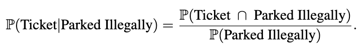

# SF_Parking
This capstone project was done in collaboration with Jeffrey Kuo, Bryan Wang, and Tessa Weiss at the University of California, Berkeley for Stat 222 under the guidance of Professor Thomas Bengtsson.

## Central Goal and Project Introduction
The initial goal of our project was rigorously answer the following two questions about San Francisco (SF) parking citations. The first being: what is the probability of receiving a parking ticket given a time and place in San Francisco given that the individual is committing an infraction? The second being: are these citations being given out fairly? Or to put it into other terms, would one be less likely to receive a parking ticket if they are parked in a wealthier neighborhood? This readme will go over how these questions were answered.

## Noteboook Table of Contents

* eda.ipynb: Combined file compiling interesting EDA from each group member for presentation.
* eda_[name].ipynb: EDA done by respective group member.
* final_probabilities.ipynb: Calculating numerator divided by denominator.
* initial_kernel.ipynb: Imports / Helper Functions / Global Variables. This was also used to calculate the numerator.
* initial_poisson.ipynb: Poisson regression model that was used as baseline model. Not incorporated in final analysis.
* meter_eda.ipynb: EDA for meter datasets.
* meter_route_eda.ipynb: More specific meter EDA.
* meters.ipynb: Estimating the denominator.
* path_pred_prototype_tim: Trying to predict enforcement route. Not incorporated in final analysis.
* preprocess.ipynb: data preprocessing for Citations and streetsweeping dataset.
* reformat_table.ipynb: formatting table for web app.

The analysis pipeline should follow the following order:

eda files -> ppreprocess.ipynb -> initial_kernel.ipynb -> meters.ipynb -> final_probabilities.ipynb -> reformat_table.ipynb

## Data
The data are directly from [data.sfgov.org](https://datasf.org/opendata/) where every citation’s information is uploaded in tabular form daily starting from 2008. Giving us the time, location (longitudinal), address, violation type, etc. We downloaded it directly as a .csv before importing it onto Python for our data wrangling. We first had to wrangle our data into data types that we could work into our geospatial and temporal analysis. To make the analysis more manageable, we filtered the data to only January 2022 to February 2023 and just meter violations.

The second dataset that we incorporated into our analysis is a street cleaning dataset. This dataset is also in a tabular csv, giving us the schedule of street cleaning corresponding to each street. Most importantly, it included the endpoints of each street segment. Where street segment is defined as one side of a block, that is intersected at each end by two or more cross streets. This dataset gives us the added granularity of not just looking at entire streets, which is an issue as there is heterogeneity in the length of streets. I.e., the number of tickets given on a street that is 5 miles long is not a direct comparison to one that is 200 feet long. Furthermore, since we are given two endpoints, we can directly calculate the distance of each street segment, something we were unable to do before with the original data.

The last two datasets we incorporated into our analysis parking meter locations and meter transactions. Where the meter locations dataset contained every meter in San Francisco, which we were able to correspond to street segments. Finally, the transaction dataset contained every payment corresponding to a meter in San Francisco.

* [Parking Citation Data](https://data.sfgov.org/Transportation/SFMTA-Parking-Citations/ab4h-6ztd)
* [Street Sweeping Data](https://data.sfgov.org/City-Infrastructure/Street-Sweeping-Schedule/yhqp-riqs)
* [Meter Transactions Data](https://data.sfgov.org/Transportation/SFMTA-Parking-Meter-Detailed-Revenue-Transactions/imvp-dq3v/data)
* [Meter Locations Data](https://data.sfgov.org/Transportation/Map-of-Parking-Meters/fqfu-vcqd)

## Why This Was an Impossible Problem to Solve With Machine Learning
When constructing our preliminary statistical model, we chose the Poisson regression. We concluded that it was the most appropriate as we were trying to approximate the rate of tickets at each location, given a time parameter, over a duration of time. However, the downside of this model is that we still could not solve the problem of not having the denominator in the following equation:

Before fitting the model, we defined a training and testing split. Training the model on January 2022 and testing it on February data. The specific model that we ultimately decided to move forward with was from CatBoostRegressor package with the Poisson objective. So given the features of longitudinal coordinates of a street section, citation type, and lag variables (of two weeks), it would predict the number of citations that would occur by street section on each day in our test set. Ultimately giving us the result of: R2 = 0.237 and the RMSE of 0.28.

