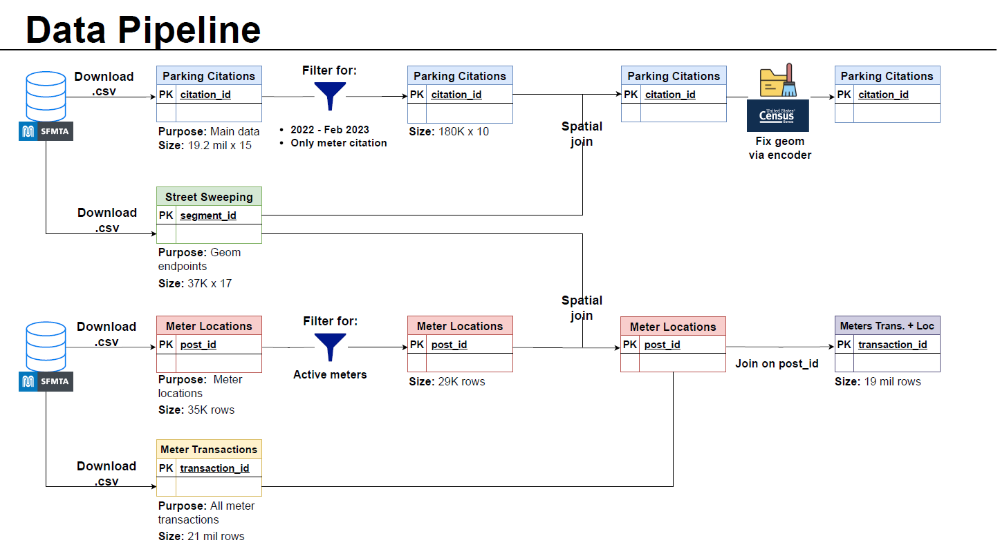

# SF_Parking
This capstone project was done in collaboration with Jeffrey Kuo, Bryan Wang, and Tessa Weiss at the University of California, Berkeley for Stat 222 under the guidance of Professor Thomas Bengtsson.

## Central Goal and Project Introduction
The initial goal of our project was rigorously answer the following two questions about San Francisco (SF) parking citations. The first being: what is the probability of receiving a parking ticket given a time and place in San Francisco given that the individual is committing an infraction? The second being: are these citations being given out fairly? Or to put it into other terms, would one be less likely to receive a parking ticket if they are parked in a wealthier neighborhood? This readme will go over how these questions were answered.

### End Result Preview
We conclude the project via an application for San Francisco residents to view probabilities on an interactive map of the city grid.

## Noteboook Table of Contents

* [eda.ipynb](https://github.com/Ttantivi/SF_Parking/blob/main/Notebooks/eda.ipynb): Combined file compiling interesting EDA from each group member for presentation.
* eda_[name].ipynb: EDA done by respective group member.
* [final_probabilities.ipynb](https://github.com/Ttantivi/SF_Parking/blob/main/Notebooks/final_probabilities.ipynb): Calculating numerator divided by denominator.
* [initial_kernel.ipynb](https://github.com/Ttantivi/SF_Parking/blob/main/Notebooks/initial_kernel.ipynb): Imports / Helper Functions / Global Variables. This was also used to calculate the numerator.
* [initial_poisson.ipynb](https://github.com/Ttantivi/SF_Parking/blob/main/Notebooks/initial_poisson.ipynb): Poisson regression model that was used as baseline model. Not incorporated in final analysis.
* [meter_eda.ipynb](https://github.com/Ttantivi/SF_Parking/blob/main/Notebooks/meter_eda.ipynb): EDA for meter datasets.
* [meter_route_eda.ipynb](https://github.com/Ttantivi/SF_Parking/blob/main/Notebooks/meter_route_eda.ipynb): More specific meter EDA.
* [meters.ipynb](https://github.com/Ttantivi/SF_Parking/blob/main/Notebooks/meters.ipynb): Estimating the denominator.
* [path_pred_prototype_tim](https://github.com/Ttantivi/SF_Parking/blob/main/Notebooks/path_pred_prototype_tim.ipynb): Trying to predict enforcement route. Not incorporated in final analysis.
* [preprocess.ipynb](https://github.com/Ttantivi/SF_Parking/blob/main/Notebooks/preprocess.ipynb): data preprocessing for Citations and streetsweeping dataset.
* [reformat_table.ipynb](https://github.com/Ttantivi/SF_Parking/blob/main/Notebooks/reformat_table.ipynb): formatting table for web app.

The analysis pipeline should follow the following order:

eda files -> [preprocess.ipynb](https://github.com/Ttantivi/SF_Parking/blob/main/Notebooks/preprocess.ipynb) -> [initial_kernel.ipynb](https://github.com/Ttantivi/SF_Parking/blob/main/Notebooks/initial_kernel.ipynb) -> [meters.ipynb](https://github.com/Ttantivi/SF_Parking/blob/main/Notebooks/meters.ipynb) -> [final_probabilities.ipynb](https://github.com/Ttantivi/SF_Parking/blob/main/Notebooks/final_probabilities.ipynb) -> [reformat_table.ipynb](https://github.com/Ttantivi/SF_Parking/blob/main/Notebooks/reformat_table.ipynb)

The following sections will be outlining the exact step by steps of the analysis, and which notebooks are corresponding to each step.

## Data Description
The data are directly from [data.sfgov.org](https://datasf.org/opendata/) where every citation’s information is uploaded in tabular form daily starting from 2008. Giving us the time, location (longitudinal), address, violation type, etc. We downloaded it directly as a .csv before importing it onto Python for our data wrangling. We first had to wrangle our data into data types that we could work into our geospatial and temporal analysis. To make the analysis more manageable, we filtered the data to only January 2022 to February 2023 and just meter violations.

The second dataset that we incorporated into our analysis is a street cleaning dataset. This dataset is also in a tabular csv, giving us the schedule of street cleaning corresponding to each street. Most importantly, it included the endpoints of each street segment. Where street segment is defined as one side of a block, that is intersected at each end by two or more cross streets. This dataset gives us the added granularity of not just looking at entire streets, which is an issue as there is heterogeneity in the length of streets. I.e., the number of tickets given on a street that is 5 miles long is not a direct comparison to one that is 200 feet long. Furthermore, since we are given two endpoints, we can directly calculate the distance of each street segment, something we were unable to do before with the original data.

The last two datasets we incorporated into our analysis parking meter locations and meter transactions. Where the meter locations dataset contained every meter in San Francisco, which we were able to correspond to street segments. Finally, the transaction dataset contained every payment corresponding to a meter in San Francisco.

* [Parking Citation Data](https://data.sfgov.org/Transportation/SFMTA-Parking-Citations/ab4h-6ztd)
* [Street Sweeping Data](https://data.sfgov.org/City-Infrastructure/Street-Sweeping-Schedule/yhqp-riqs)
* [Meter Transactions Data](https://data.sfgov.org/Transportation/SFMTA-Parking-Meter-Detailed-Revenue-Transactions/imvp-dq3v/data)
* [Meter Locations Data](https://data.sfgov.org/Transportation/Map-of-Parking-Meters/fqfu-vcqd)

## Why This Was an Impossible Problem to Solve With Machine Learning
When constructing our preliminary statistical model, we chose the Poisson regression (this was done within [initial_poisson.ipynb](https://github.com/Ttantivi/SF_Parking/blob/main/Notebooks/initial_poisson.ipynb)). We concluded that it was the most appropriate as we were trying to approximate the rate of tickets at each location, given a time parameter, over a duration of time. However, the downside of this model is that we still could not solve the problem of not having the denominator in the following equation:

Before fitting the model, we defined a training and testing split. Training the model on January 2022 and testing it on February data. The specific model that we ultimately decided to move forward with was from CatBoostRegressor package with the Poisson objective. So given the features of longitudinal coordinates of a street section, citation type, and lag variables (of two weeks), it would predict the number of citations that would occur by street section on each day in our test set. Ultimately giving us the result of: R2 = 0.237 and the RMSE of 0.28.

It became evident that the Poisson Regression model reached a dead end due to the limited information available. Even if we could accurately predict the count, it would be impossible to calculate the denominator. Thus, we were unable to calculate probabilities with this approach.

This realization prompted us to reconsider the probabilities we were trying to calculate and instead define a proxy probability that could be calculated. Before introducing this proxy, we made certain modeling assumptions. We assumed that if a car is committing an infraction and a parking enforcement officer is on the street, then the car is guaranteed to receive a ticket. Additionally, we assumed that all parking spots are consistently occupied. Under these assumptions, our focus shifted from the number of cars committing infractions to the mere presence of an infraction. Therefore, our goal became predicting the probability of enforcement officers being present on a given street section.

## Final Model
### Notation
Before delving into data sources and determining the necessary information for estimating probabilities, let us establish some notation and frame the problem at hand. We have defined the following variables:

Where *W* is the set containing the days of the week. *S* is the set containing the segment ID of all unique street segments in San Francisco. *T* is the start time bin incremented by 15 minute intervals containing all times when parking meters are enforced. *E* is the event that enforcement happens and *I* is the event that someone is parking illegally.

Suppose we are at time t, on street segment s, on weekday w. Then we want to know the probability that we get a ticket given that we parked illegally. We denote this as the following:

Then applying the conditional probability formula, we get line two. This is ultimately the form we are trying to calculate. We can now construct estimates of the numerator and denominator from the data.

### Preparing Data for Analysis
In our analysis, we are working with four distinct tables, each color-coded in Figure 1. The top sequence of tables corresponds to the data that provides us with the numerator for our calculations, while the bottom sequence represents the tables that contribute to the denominator. The primary dataset we are utilizing is the SFMTA parking citations dataset, represented by the blue tables. This dataset comprises 19 million rows, with each row corresponding to a unique citation incident. We applied filters to consider only violations that occurred between the years 2022 and 2023 and meter violations.

In order to obtain the street ID associated with each citation incident, as the blue dataset only provided latitude and longitude information, we performed a spatial join with the street sweeping dataset, represented by the green table. This dataset contains the geometric endpoints of each street segment. To ensure data quality and correct for any inaccuracies in the geometric encodings, we utilized the US Census geoencoder. This step was crucial in achieving the final dataset required for estimating the numerator of our probability calculation.

These previous steps were done in [preprocess.ipynb](https://github.com/Ttantivi/SF_Parking/blob/main/Notebooks/preprocess.ipynb) and [initial_kernel.ipynb](https://github.com/Ttantivi/SF_Parking/blob/main/Notebooks/initial_kernel.ipynb).

To estimate the denominator, denoted as *P(I)*, we need to identify all instances of illegal parking. In order to achieve this, we focus on meter violations since there exists comprehensive transactional data for each meter in San Francisco. This information is available in the yellow dataset. By considering the transaction data and the corresponding meter locations, we can infer the times when parking meters were unpaid. Under the modeling assumption that highly trafficked spots are consistently occupied, these unpaid instances represent cases of illegal parking. By utilizing this dataset, we can estimate the denominator required for our probability calculation.

We acquired the meter location dataset from the SFMTA, represented by the red tables. We applied filters to consider only active meters. Next, we performed a spatial join with the street sweeping dataset, allowing us to associate unique street IDs with the meter locations. This step, represented by the green tables, helped establish the relationship between meter locations and specific street segments.

Finally, we joined the resulting dataset with the meter transaction dataset, represented by the yellow tables. This combination enabled us to obtain all transactional data associated with each meter located on each street segment. By completing these steps, we obtained the final tables necessary to estimate the denominator for our probability calculation.

The bottom sequence was conducted in this notebook: [meters.ipynb](https://github.com/Ttantivi/SF_Parking/blob/main/Notebooks/meters.ipynb).

### Final Modeling Steps
We begin by outlining to steps to calculating the following probability illustrated in Figure 2:

Without loss of generality, we focus on an example where we are on a specific street segment, denoted as s, and a particular day of the week, such as Wednesday. We begin by taking each citation incident that occurred on a Wednesday within street segment s and assigning it to a fifteen-minute time bin. For example, a ticket issued at 9:02 would be allocated to the 9:00 bin, while a ticket at 9:23 would be assigned to the 9:15 bin, and so on.

To obtain a single representative ticket for each time bin on Wednesdays, we record only one ticket if there were multiple citations during the same Wednesday period. This step ensures that we have an indicator of whether or not there was at least one instance of enforcement and illegal parking on a specific day. Finally, we calculate the sum of the number of tickets within each time bin and divide it by the total number of Wednesdays present in the dataset. This computation provides us with an estimate of the probability of *P(E AND I | W = Wednesday, Street = s)* for a specific time bin.

The calculation of the numerator was done in [initial_kernel.ipynb](https://github.com/Ttantivi/SF_Parking/blob/main/Notebooks/initial_kernel.ipynb).

The following figure illustrates how we calculated the denominator:

Once again without loss of generality, we consider a single specific Wednesday, observing all time slots, for a distinct section of street s that contains multiple parking meters. For each meter we bin the transactions into 15-minute intervals. We also incorporate a 3-minute grace period to allow for the transition between one car leaving and the subsequent vehicle parking and completing payment.

In instances where no transactions span a 15-minute slot, or if there are transaction gaps exceeding our 3-minute buffer, we declare the meter as unpaid during that period. We then accumulate all the intervals in which at least one meter remained unpaid on that street segment. This data is used to generate an indicator for the corresponding time slot.

While not explicitly illustrated in the figure, we sum up these indicators across all Wednesdays and divide by the total count of Wednesdays within our dataset with respect to each time bin. This provides an estimate of *P(I | W = Wednesday, Street = s)*.

The denominator was calculated in: [meters.ipynb](https://github.com/Ttantivi/SF_Parking/blob/main/Notebooks/meters.ipynb).

To get the final probability, we simply perform the division with respect to *T, S, W*. Which was done within [final_probabilities.ipynb](https://github.com/Ttantivi/SF_Parking/blob/main/Notebooks/final_probabilities.ipynb)

## Application of Our Analysis
### The Application
To make our probabilities more concrete and applicable for San Francisco's residents, we designed an interactive web application illustrated in Figure 4. This tool allows users to select a specific time, day of the week, and desired parking duration, ranging from 15 minutes to 2 hours. It then displays the probability of receiving a parking ticket for each street segment in real-time. A color gradient is used for visual clarity, with more intense red indicating a higher ticket probability.

By hovering over a street, users can view the exact probability of receiving a ticket within a fifteen-minute interval. Additionally, clicking on a street segment triggers a displays a plot with time on the X-axis and the expected cost in dollars on the Y-axis. This feature allows users to visualize the expected cost of illegal parking on a specific street segment for a given duration, and compare this with the cost of paying for the meter.

To calculate the probability multiple time intervals, we treat each interval as an independent Bernoulli and use the following equation:

### Limitations of Our Model
To manage the complexity of this application, we made a few modeling assumptions. First, we treated the average cost per hour for all meters, $3.50, as a constant across all meters and time intervals. In reality, this is not accurate as meter prices in San Francisco are dynamically adjusted in response to demand. Secondly, we assumed the average cost of a parking violation, $93.50, to be the standard for all tickets. However, the actual cost varies between downtown and non-downtown locations. Lastly, our model presumes that these parking spots are occupied at all times. Therefore, our model tends to be more accurate for busy areas near major points of interest, but less so for less trafficked locations. It's important to keep these assumptions in mind when interpreting the outputs of our web application.

## Further Work
As previously noted, our assumption that metered spots are consistently occupied is only accurate in certain areas. This means that in many cases, our model may underestimate the real probability of receiving a parking ticket. Acquiring data that could help refine this assumption would require on-the-ground presence in San Francisco, which was not feasible for us during the semester. However, future improvements could be made through methods like conducting surveys to gather actual infraction rates, or installing parking sensors at a sample of metered spots. 

Returning to the question of equity, our estimated probabilities could serve as a tool for assessing whether ticketing is conducted fairly across the city. To further probe this issue, we could conduct an ANOVA across different neighborhoods. This would enable us to determine if certain parts of the city are disproportionately ticketed relative to factors like the size of the area, number of meters, and other relevant parameters. Such an analysis could provide valuable insights into the equitable distribution of parking enforcement, potentially highlighting areas for improvement in the city's ticketing policy.

## References
1. Ning Jia (2022): [What are the odds of getting a parking ticket in Toronto?](https://towardsdatascience.com/what-are-the-odds-of-getting-a-parking-ticket-in-toronto-1f090dd0c608)
2. Song Gao, Mingxiao Li, Yunlei Liang, Joseph Marks, Yuhao Kang & Moying Li (2019): Predicting the spatiotemporal legality of on-street parking using open data and machine learning, Annals of GIS, DOI: 10.1080/19475683.2019.1679882
3. **Parking Citation Data:** [https://data.sfgov.org/Transportation/SFMTA-Parking-Citations/ab4h-6ztd](https://data.sfgov.org/Transportation/SFMTA-Parking-Citations/ab4h-6ztd)
4. **Street Sweeping Data:** [https://data.sfgov.org/City-Infrastructure/Street-Sweeping-Schedule/yhqp-riqs](https://data.sfgov.org/City-Infrastructure/Street-Sweeping-Schedule/yhqp-riqs)
5. **Census geocoder:** [https://geocoding.geo.census.gov/geocoder/](https://geocoding.geo.census.gov/geocoder/)
6. **Meter Transactions:** [https://data.sfgov.org/Transportation/SFMTA-Parking-Meter-Detailed-Revenue-Transactions/imvp-dq3v/data](https://data.sfgov.org/Transportation/SFMTA-Parking-Meter-Detailed-Revenue-Transactions/imvp-dq3v/data)
7. **Meter Locations:** [https://data.sfgov.org/Transportation/Map-of-Parking-Meters/fqfu-vcqd](https://data.sfgov.org/Transportation/Map-of-Parking-Meters/fqfu-vcqd)
